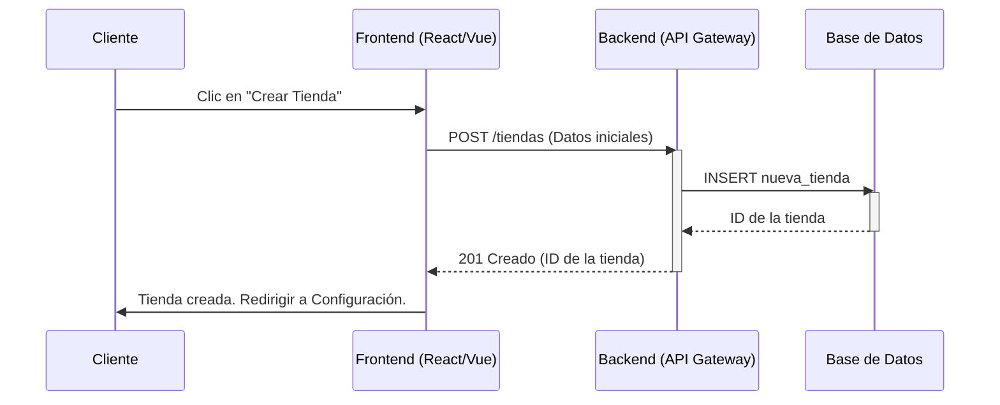
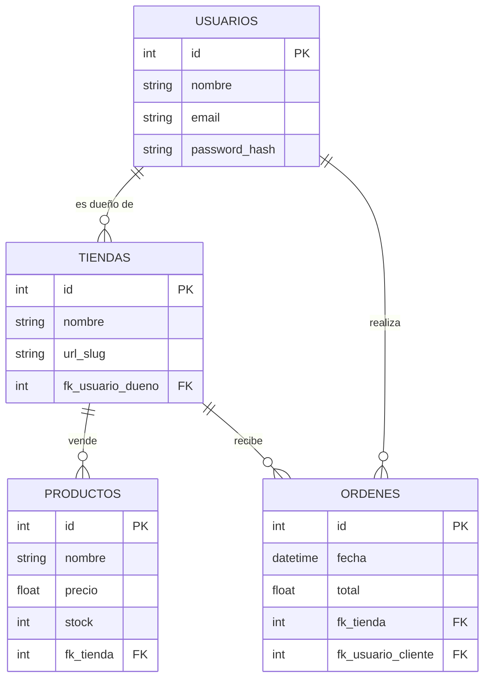

# Arquitectura del Sistema SaaS

## I. Visión del Producto

### 1.1 Problema que Resuelve (El Dolor del Cliente)
Las soluciones actuales de e-commerce (como Shopify o WooCommerce) se han vuelto **excesivamente complejas y costosas** para el emprendedor moderno.
- **Altas Tarifas de Transacción**: Los competidores cobran comisiones por venta (hasta un 2.9% + 30¢) además de la suscripción mensual, erosionando los márgenes de beneficio.
- **Curva de Aprendizaje Abrupta**: La configuración de temas y plugins requiere conocimientos técnicos o la contratación de expertos, desviando recursos del negocio principal.
- **Falta de Personalización Real**: Las tiendas terminan viéndose idénticas ("Cookie-cutter stores") sin reflejar la identidad única de marcas nicho.

### 1.2 Propuesta de Valor (Value Proposition)
Nuestra plataforma es el **anti-Shopify**: una solución optimizada para la velocidad y la rentabilidad.
- **Cero Tarifas de Transacción**: Nuestro modelo de negocio se basa en una suscripción plana transparente. Tu éxito es tuyo; no "impuestos" ocultos sobre tus ventas.
- **Mobile-First & Performance**: Arquitectura diseñada para tiempos de carga instantáneos (Core Web Vitals optimizados por defecto), crucial para la conversión en ventas móviles.
- **Simplicidad Radical**: Un panel de control que permite lanzar una tienda profesional en minutos, no semanas, sin tocar una línea de código.

### 1.3 Público Objetivo (Target Audience)
- **PyMES de Alta Rotación**: Negocios que manejan inventario físico dinámico y necesitan agilidad para actualizar catálogos.
- **Vendedores Nicho y D2C (Direct-to-Consumer)**: Marcas que buscan una estética diferenciada y una conexión directa con sus clientes sin intermediarios costosos.
- **Emprendedores No-Técnicos**: Usuarios que valoran la facilidad de uso por encima de la extensibilidad infinita y compleja.

---

## II. Arquitectura Técnica

### 2.1 Diagramas de Arquitectura

#### Diagrama de Secuencia: Creación de Tienda

#### Diagrama Entidad-Relación (ER)

### 2.2 Stack Tecnológico (Propuesta CTO)

Para garantizar escalabilidad, rendimiento y mantenibilidad a largo plazo, se ha seleccionado la siguiente pila tecnológica moderna:

#### Frontend: **Next.js (React)**
- **Justificación**: Framework líder para React que ofrece Server-Side Rendering (SSR) y Static Site Generation (SSG) nativos, cruciales para el SEO de las tiendas de los clientes. Su ecosistema (Vercel) facilita el despliegue y la optimización de imágenes.

## III. Documentación de API

### 3.1 Estándares
- RESTful API
- Formato JSON para peticiones y respuestas.
- Autenticación vía JWT (JSON Web Tokens).

### 3.2 Referencia Detallada
Para ver la especificación completa de los endpoints, incluyendo parámetros y ejemplos de respuesta, consulta la [Referencia de API](./API_Reference.md).

### 3.3 Endpoints Principales (Resumen)
- **Tiendas**: Gestión de tiendas y configuraciones.
- **Productos**: CRUD de inventario.
- **Ordenes**: Procesamiento de compras.

---

## IV. Guías de Operación y Despliegue

### 4.1 Proceso de Despliegue (5 Pasos)

Este pipeline asegura una entrega continua, escalable y confiable del SaaS.

#### 1. Empaquetado (Packaging)
Utilizamos **Docker** para contenerizar todos los microservicios (API, Frontend, Workers).
- **Dockerfile**: Cada servicio tiene su propio Dockerfile optimizado (ej. Multi-stage builds para reducir tamaño).
- **Inmutabilidad**: Las imágenes generadas son inmutables y contienen todas las dependencias necesarias.

#### 2. Registro (Registry)
Las imágenes construidas se almacenan en un registro privado seguro.
- **Herramientas**: Docker Hub (Plan Pro) o Google Container Registry (GCR).
- **Versioning**: Se utiliza Semantic Versioning (v1.0.0) y tags de commit (sha-12345) para trazabilidad.

#### 3. Orquestación (Orchestration)
**Kubernetes (K8s)** gestiona el ciclo de vida de los contenedores en producción.
- **Cluster**: Nodos gestionados (EKS/GKE) para alta disponibilidad.
- **Servicios**:
    - `Deployment`: Para aplicaciones stateless (API, Frontend).
    - `StatefulSet`: Para bases de datos (si no se usa DB gestionada).
    - `Ingress`: Para enrutamiento de tráfico externo y terminación SSL.

#### 4. CI/CD (Integración y Despliegue Continuo)
Automatización completa mediante **GitHub Actions**.
- **CI**: Al hacer push, se ejecutan tests unitarios y linter. Si pasan, se construye la imagen Docker.
- **CD**: Al mergear a `main`, se despliega automáticamente a Staging. El paso a Producción requiere aprobación manual.

#### 5. Monitoreo y Observabilidad
Visibilidad completa del estado del sistema.
- **Métricas**: **Prometheus** recolecta métricas de infraestructura y negocio.
- **Visualización**: **Grafana** para dashboards en tiempo real (CPU, Memoria, Request/sec).
- **Alerting**: Reglas configuradas para notificar latencias altas o caídas de pods.

### 4.2 Métricas de Éxito
Para un desglose detallado de los KPIs financieros y técnicos que monitoreamos, consulta el documento de [Métricas Clave de Rendimiento (KPIs)](./KPIs.md).

## 2.1 Pila Tecnológica (Tech Stack) Justificada
Pila Tecnológica (Tech Stack) Justificada
Para garantizar la escalabilidad, el rendimiento y la mantenibilidad a largo plazo de nuestro SaaS, propongo la siguiente arquitectura tecnológica:

Frontend: Next.js (React)
Justificación: Next.js es el estándar de la industria para aplicaciones React de producción. Ofrece Server-Side Rendering (SSR) y Static Site Generation (SSG) de forma nativa, lo cual es crítico para el SEO de las tiendas de nuestros clientes y para tiempos de carga inicial rápidos (Core Web Vitals). Su ecosistema robusto y la facilidad de despliegue en el borde (Edge) aseguran una experiencia de usuario premium.
Backend: NestJS (Node.js)
Justificación: NestJS proporciona una arquitectura modular y estructurada (inspirada en Angular) sobre Node.js, ideal para construir microservicios escalables. Su soporte de primera clase para TypeScript reduce errores en tiempo de desarrollo y facilita el mantenimiento de una base de código compleja. Además, su sistema de inyección de dependencias y decoradores estandariza el desarrollo entre diferentes equipos.
Base de Datos Principal: PostgreSQL
Justificación: PostgreSQL es la base de datos relacional de código abierto más avanzada. Su conformidad con ACID garantiza la integridad de los datos transaccionales (pedidos, pagos, inventario), lo cual es no negociable en e-commerce. Su capacidad para manejar datos no estructurados con JSONB nos da la flexibilidad de una base de datos NoSQL para atributos de productos dinámicos sin perder la robustez relacional.
Mensajería y Caching: Redis & RabbitMQ
Redis (Caching): Implementaremos Redis para almacenar en caché sesiones de usuario, carritos de compra y respuestas de API frecuentes. Esto reduce drásticamente la carga en la base de datos principal y proporciona respuestas en milisegundos.
RabbitMQ (Mensajería): Utilizaremos RabbitMQ como broker de mensajería para desacoplar nuestros microservicios. Esto permite el procesamiento asíncrono de tareas pesadas (ej. generación de facturas, envío de emails, actualizaciones de stock masivas), asegurando que la interfaz de usuario permanezca receptiva incluso durante picos de tráfico.