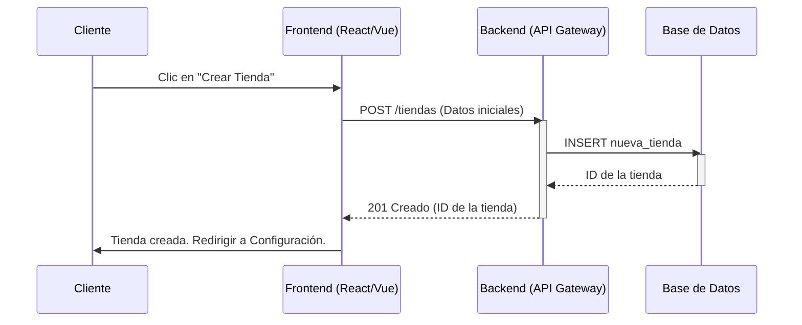
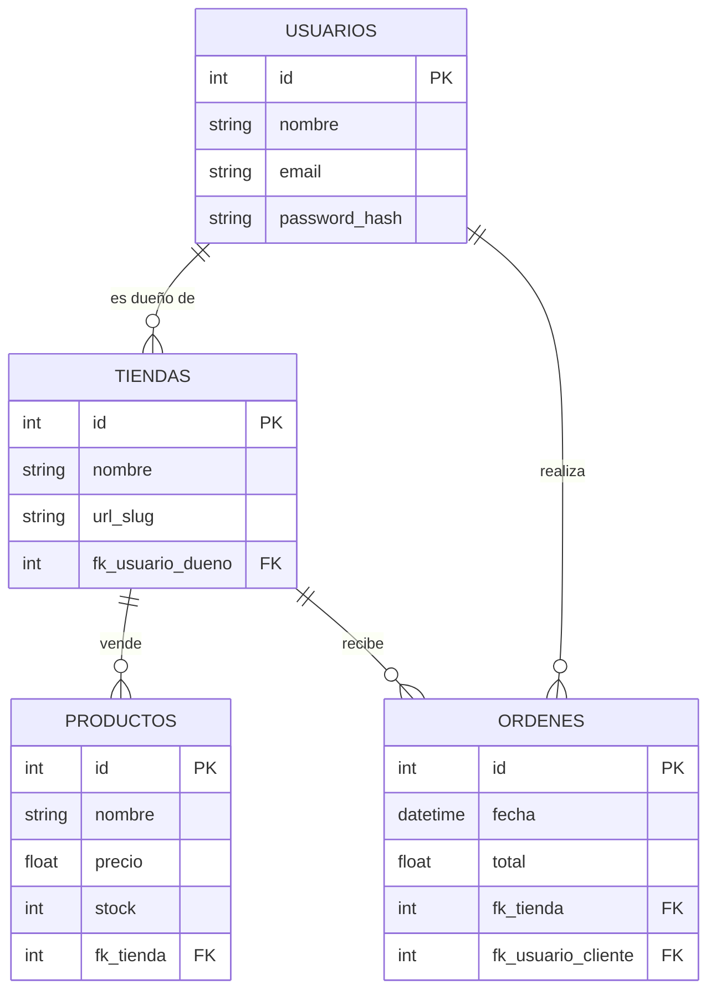

# Arquitectura del Sistema SaaS

## I. Visión del Producto
### 1.1 Resumen Ejecutivo
Plataforma SaaS para la creación y gestión de tiendas en línea, diseñada para emprendedores y PYMEs que buscan una solución robusta, escalable y fácil de usar.

### 1.2 Alcance del Proyecto
- Gestión de inventario y productos.
- Procesamiento de órdenes y pagos.
- Personalización de tiendas (temas).
- Panel de administración para dueños de tiendas.

### 1.3 Usuarios Objetivo
- **Comerciantes**: Dueños de negocios que venden productos.
- **Clientes Finales**: Compradores en las tiendas.
- **Administradores del Sistema**: Personal de soporte y mantenimiento del SaaS.

### 1.4 Roadmap
- **Fase 1**: MVP (Gestión básica de productos y órdenes).
- **Fase 2**: Integración de pasarelas de pago y envíos.
- **Fase 3**: Marketplace de temas y plugins.

---

## II. Arquitectura Técnica

### 2.1 Diagramas de Arquitectura

#### Diagrama de Secuencia: Creación de Tienda

#### Diagrama Entidad-Relación (ER)

### 2.2 Stack Tecnológico
- **Frontend**: React / Vue.js
- **Backend**: Node.js / Python
- **Base de Datos**: PostgreSQL / MySQL
- **Infraestructura**: AWS / Google Cloud

### 2.3 Modelos de Datos
Descripción detallada de las entidades principales (ver Diagrama ER).

---

## III. Documentación de API

### 3.1 Estándares
- RESTful API
- Formato JSON para peticiones y respuestas.
- Autenticación vía JWT (JSON Web Tokens).

### 3.2 Endpoints Principales
#### Tiendas
- `POST /api/v1/tiendas`: Crear nueva tienda.
- `GET /api/v1/tiendas/{id}`: Obtener detalles de tienda.

#### Productos
- `GET /api/v1/tiendas/{id}/productos`: Listar productos.
- `POST /api/v1/productos`: Agregar producto.

#### Ordenes
- `POST /api/v1/ordenes`: Crear orden.
- `GET /api/v1/ordenes/{id}`: Ver estado de orden.

---

## IV. Guías de Operación y Despliegue

### 4.1 Estrategia de Despliegue (CI/CD)
- Pipelines automatizados con GitHub Actions / GitLab CI.
- Entornos: Desarrollo, Staging, Producción.

### 4.2 Monitoreo y Logging
- **Logs**: Centralizados (ELK Stack o Datadog).
- **Métricas**: Uso de CPU, Memoria, Latencia de API.
- **Alertas**: Notificaciones por Slack/Email ante fallos críticos.

### 4.3 Recuperación de Desastres
- Backups diarios de base de datos.
- Plan de restauración y failover.